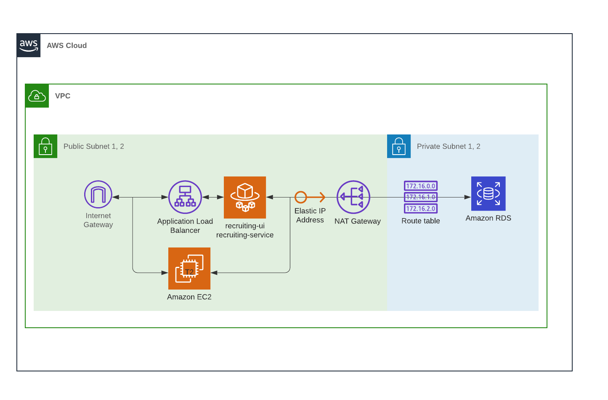

# Infra

This repo constains [infrastructure as code](https://en.wikipedia.org/wiki/Infrastructure_as_code) to setup the following resources in AWS:



# Installations

To get started install these things:

```
/usr/bin/ruby -e "$(curl -fsSL https://raw.githubusercontent.com/Homebrew/install/master/install)"
brew install terraform
brew install python
sudo /usr/local/bin/python3.7 awscli-bundle/install -i /usr/local/aws -b /usr/local/bin/aws
```

Test installations with the following commands:
```
python --version
aws --version
terraform --version
```

# Config variables.tf

Replace <redacted> with real values in `variables.tf`

You'll need to fill in your values. including getting your public key:
`ssh-keygen -y -f ~/.aws/<your_file>.pem`

then import it:
`terraform import aws_key_pair.deployer <name of your key>`

# Initialize the plugins
Execute the following command:
`terraform init`

# Plan, Apply

Execute the following commands:
`terraform plan`

to plan this out in smaller chunks you can use:
terraform plan -target resource.name -out resource.plan

`terraform apply`

# Access EC2 bastion to create db

Unfortunately typeorm doesn't allow for creating the postgres database with syncronize.
Therefore, the following steps are a workaround to use the bastion ec2 instance to config the db:

```
SSH into the host
ssh -i ~/.aws/<your_key_here>.pem ubuntu@ec2-<your_ip_here>.compute-1.amazonaws.com

sudo sh -c 'echo "deb http://apt.postgresql.org/pub/repos/apt/ `lsb_release -cs`-pgdg main" >> /etc/apt/sources.list.d/pgdg.list'
wget -q https://www.postgresql.org/media/keys/ACCC4CF8.asc -O - | sudo apt-key add -
sudo apt-get update
sudo apt-get upgrade

sudo apt-get install postgresql postgresql-contrib libpq-dev pgadmin3 postgresql-client-common

createdb <your_database_name> -h <your_db_instance_id_here>.us-east-1.rds.amazonaws.com -U <your_admin_account_name> -W 
enter password

psql <your_database_name> -h <your_db_instance_id_here>.us-east-1.rds.amazonaws.com -U <your_admin_account_name> -W 
enter password

create schema
alter tables to point to new schema
```

# References

[deploying containers on amazons ecs using fargate - part 1](https://medium.com/@bradford_hamilton/deploying-containers-on-amazons-ecs-using-fargate-and-terraform-part-1-a5ab1f79cb21)

[deploying containers on amazons ecs using fargate - part 2](https://medium.com/@bradford_hamilton/deploying-containers-on-amazons-ecs-using-fargate-and-terraform-part-2-2e6f6a3a957f)

[deploying hasura on aws with fargate, rds and terraform](https://dev.to/lineup-ninja/deploying-hasura-on-aws-with-fargate-rds-and-terraform-4gk7)